# PyCity Schools Analysis Report
Prepared by Robert Gallagher

## Overview

The purpose of this report is to analyize the impact of removing altered data for the Thomas High School ninth grade students from the PyCity Schools student reading and writing scores to the following views.
- District level summary
- School summary
- Top 5 schools
- Bottom 5 schools
- Average reading and math scores by grade level
- Scores by per student spending
- Scores by school size
- Scores by school type

The work for this is done by the following script:
[PyCitySchools_Challenge.ipynb](PyCitySchools_Challenge.ipynb)

## Results

- District summary dataframes
    - Original
    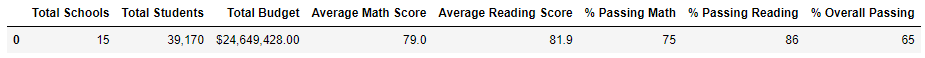
    - Corrected
    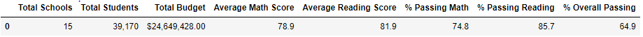

- School summary dataframes: The only updated line in this dataframe was the Thomas High School row so that is all that is shown below.
    - Original

    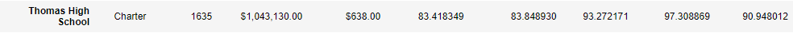
    - Corrected

    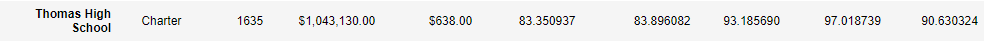

- Top 5 schools
    - Original

    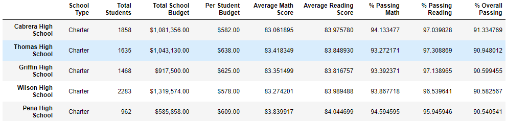

    - Corrected

    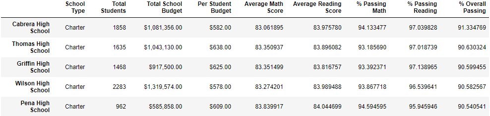

- Bottom 5 schools
    - Original

    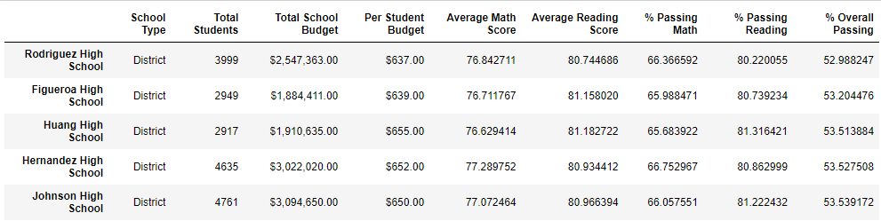

    - Corrected

    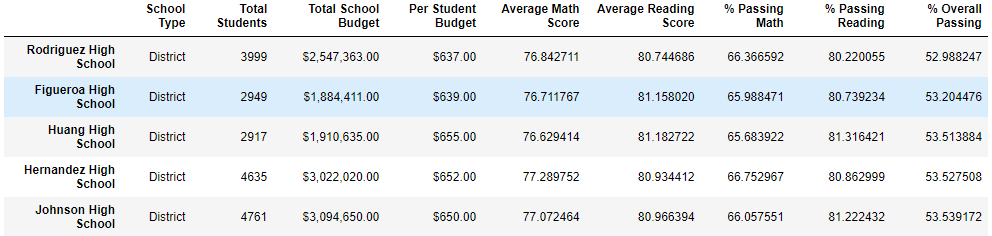

- Average reading scores by grade
    - Original

    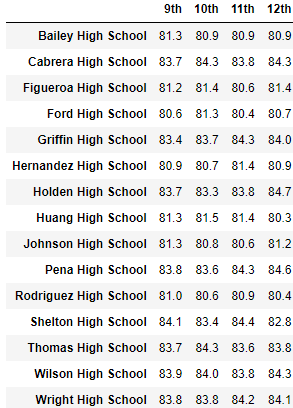
    - Corrected

    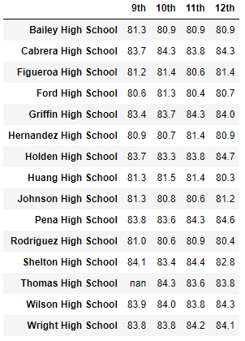

- Average math scores by grade
    - Original

    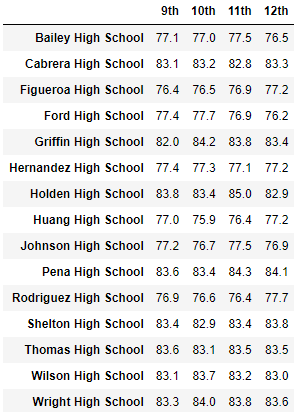
    - Corrected

    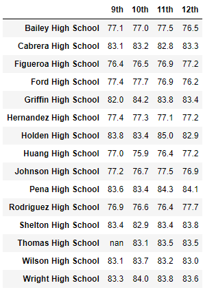

- Scores by per student spending
    - Original

    
    - Corrected

    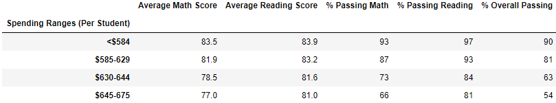

- Scores by school size
    - Original

    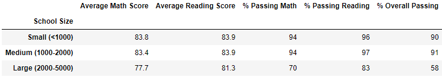
    - Corrected

    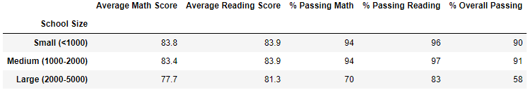

- Scores by school type
    - Original

    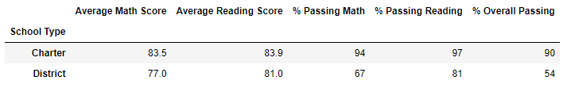
    - Corrected
    
    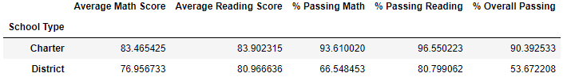
    
## Summary

- School district impact:  As you can see from above replacing the Thomas High School 9th grade scores with null values only slightly decreased our metrics.  See a summary of the movements in the list below.  Overall at the district level this did not significantly change results.
    - Average Math Score decrease by .1 point
    - % Passing Math decreased by .2 percent
    - % Passing Reading decreased by .1%
    - % Overall Passing decreased by .3%
    
- School summary impact:  The only row impacted in this dataframe was the row for Thomas High School.  See the list below for a summary of the changes.
    - Average Math Score decreased by .06 points
    - Average Reading Score increased by .05 points
    - % Passing Math decreased by 26.4%
    - % Passing Reading deceased by 27.6%
    - % Overall Passing decreased by 25.9%
    
- Top 5 schools did not change order

- Bottom 5 schools did not change order