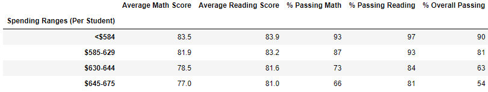
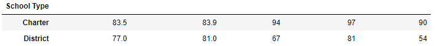

# PyCity Schools Analysis Report
Prepared by Robert Gallagher

## Overview

The purpose of this report is to analyize the impact of removing altered data for the Thomas High School ninth grade students from the PyCity Schools student reading and writing scores to the following views.
- District level summary
- School summary
- Top 5 schools
- Bottom 5 schools
- Average reading and math scores by grade level
- Scores by per student spending
- Scores by school size
- Scores by school type

The work for this is done by the following script:
[PyCitySchools_Challenge.ipynb](PyCitySchools_Challenge.ipynb)

## Results

- District summary dataframes
    - Original
    
    - Corrected
    

- School summary dataframes: The only updated line in this dataframe was the Thomas High School row so that is all that is shown below.
    - Original

    
    - Corrected

    

- Top 5 schools
    - Original

    

    - Corrected

    

- Bottom 5 schools
    - Original

    

    - Corrected

    

- Average reading scores by grade
    - Original

    
    - Corrected

    

- Average math scores by grade
    - Original

    
    - Corrected

    

- Scores by per student spending
    - Original

    
    - Corrected

    

- Scores by school size
    - Original

    
    - Corrected

    

- Scores by school type
    - Original

    
    - Corrected
    
    